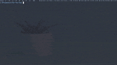

# Tic-Tac-Toe
An interactive Tic-Tac-Toe game, written in C and played through a terminal with simple text-based graphics. Includes a two-player game mode and a single player mode with an AI adversary. The AI is implemented effectively to play like a human player.

## Installation and Execution Instructions
(Must be running Linux)

From inside the cloned Tic-Tac-Toe directory...

Run the `make` command.

Then run the program by entering `./tictactoe`
